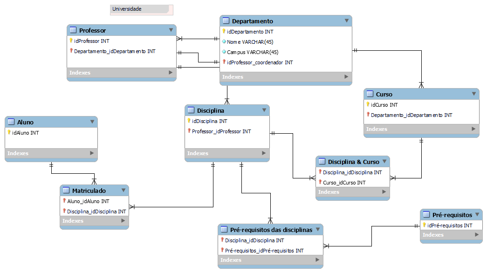

<h1>
    
     Desafio de Projeto: Apresentação do Desafio de Modelagem Dimensional - Star Schema
</h1>

_Inicialmente, é importante ressaltar que embora o desafio na plataforma seja intitulado “Dashboard de Vendas com Power BI utilizando Star Schema”, o objetivo principal era, na verdade, construir um **modelo de dados em formato de Star Schema voltado para a Análise de Dados Acadêmico.**_

## Objetivo

Aplicar os conceitos de _Modelagem Dimensional, especificamente o Star Schema_, a um conjunto de dados acadêmicos sobre professores, construindo um modelo de dados a partir de um _Diagrama Relacional_ fornecido.

## Diagrama Relacional

Diagrama Relacional disponibilizado pelo instrutor que serviu como ponto de partida:

## Descrição do Trabalho

O desafio consistiu na concepção e implementação de um _Modelo Dimensional em formato Star Schema_. A tabela de fatos centraliza as informações sobre as atividades docentes, incluindo cursos ministrados, disciplinas e vinculação departamental. Tabelas de dimensão foram elaboradas para detalhar atributos como cursos, disciplinas, departamentos e datas, proporcionando granularidade e flexibilidade na análise. A modelagem e a consulta aos dados foram realizadas utilizando a ferramenta _MySQL Workbench_.

## Estrutura de Tabelas Criadas

### Tabela Fatos
 * **Fato_Professor:** Armazena as medidas e as referências para as tabelas de dimensões.
    * **Chaves estrangeiras:** _idDisciplina, idCurso, idDepartamento, idDataOfertaDisciplina, idDataOfertaCurso_

### Dimensões
* Criei tabelas de dimensões como `Dim_Departamento`, `Dim_Disciplina`, `Dim_Curso` e uma `Dim_Data` para registrar as datas. As dimensões representam as entidades que foram derivadas do modelo relacional original.
* **Dim_Data:** 
    * **Objetivo:** Registrar datas em diferentes granularidades (dia, mês, ano, trimestre, semestre).
    * **Motivo:** Compensar a falta de datas no modelo relacional original.

### Relacionamentos Estabelecidos
O relacionamento das tabelas de dimensão está estruturado de forma que cada dimensão, como `dim_data`, `dim_disciplina`, `dim_curso` e `dim_departamento`, se conecta à tabela de fatos `fato_professor` através de chaves estrangeiras. As dimensões contêm informações como datas, disciplinas, cursos e departamentos, e cada uma delas possui uma chave primária que é referenciada na tabela de fatos. Esses relacionamentos são do tipo um-para-muitos, o que significa que um único registro em uma tabela de dimensão pode estar associado a múltiplos registros na tabela de fatos, facilitando a agregação e análise dos dados.

<!-- Script de criação executado no MySQL Workbench -->

## Conclusão e Resultados Obtidos

Modelo Dimensional em formato Star Schema

O desafio foi concluído dentro do prazo proposto. Foi implementado um modelo de Star Schema no MySQL Workbench. A inclusão da tabela `dim_data` permitiu a análise de dados em diferentes granularidades temporais, como diário, mensal ou anual, proporcionando maior flexibilidade para futuras consultas e análises. Como exemplos de insights obtidos com base no modelo gerado, podemos citar: a quantidade de disciplinas ministradas por professor ao longo do tempo e a análise de períodos com maior concentração de ofertas de disciplinas ou cursos.

## Contribuições
Sinta-se à vontade para contribuir para este projeto! Se você encontrar algum problema ou tiver sugestões de melhorias, abra um issue ou envie um pull request.

